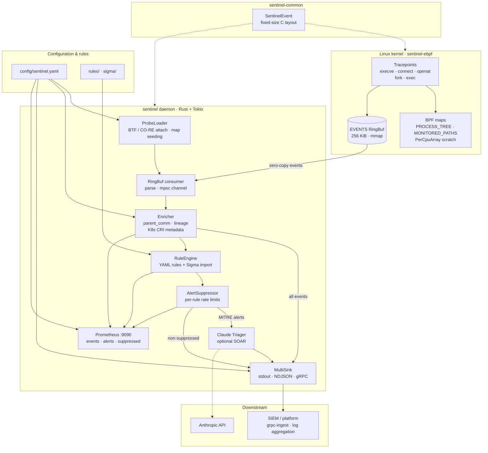

# ebpf-sentinel

**🛡️ eBPF-native Linux endpoint detection · 📜 detection-as-code · 🤖 Claude-powered alert triage**

[](https://github.com/xonoxitron/ebpf-sentinel/actions/workflows/ci.yml)
[](LICENSE)


> Production-oriented proof-of-concept for **kernel-level Linux endpoint security**: eBPF sensors, scalable telemetry pipelines, YAML detection-as-code, and **Claude-assisted SOAR triage** — designed for AI/ML infrastructure where observability must not compete with GPU workloads.

---

## Why this project exists

**ebpf-sentinel** is a hands-on implementation of a modern **Linux node sensor** — the kind of system used on detection platforms that protect large fleets of training and inference hosts. It demonstrates:

- **eBPF kernel instrumentation** (tracepoints, ring buffers, in-kernel maps) with minimal userspace overhead
- **Detection engineering** via version-controlled YAML rules mapped to **MITRE ATT&CK**
- **Security telemetry pipelines** (NDJSON, gRPC/protobuf) suitable for SIEM and internal platforms
- **AI-assisted detection & response** using the Anthropic Messages API for structured triage on ML-heavy endpoints

If you are evaluating candidates for **Linux kernel security**, **EDR**, **detection engineering**, or **AI × security** roles — this repository is meant to be clone-and-buildable evidence of end-to-end ownership.

---

## Architecture



**Telemetry path** — every kernel event is parsed, enriched, optionally emitted to sinks, and counted in Prometheus.

**Detection path** — enriched events are evaluated against YAML/Sigma rules; matches pass through suppression and optional Claude triage before alert export.

### Design principles for ML workloads

| Concern | Approach |
|--------|----------|
| **CPU overhead** | Kernel events via tracepoints; single ring buffer; no per-event syscalls from probes |
| **Memory** | Fixed-size `#[repr(C)]` events; per-CPU scratch map avoids BPF stack exhaustion |
| **False positives on training nodes** | Claude triage prompt encodes ML context (PyTorch, checkpoints, telemetry) |
| **Fleet scale** | Stateless daemon; gRPC ingest for centralized pipelines; NDJSON for log aggregation |
| **Maintainability** | Rust userspace + Rust eBPF ([Aya](https://aya-rs.dev)); shared `sentinel-common` types |

---

## Feature matrix (job-relevant capabilities)

| Capability | Implementation |
|-----------|----------------|
| **eBPF / kernel sensors** | `sentinel-ebpf`: execve, connect, openat, fork/exec lineage, FIM |
| **Rust systems programming** | Workspace crates, `no_std` eBPF, async userspace daemon |
| **Detection-as-code** | YAML rules, regex pre-compiled at startup, MITRE metadata |
| **SIEM / log aggregation** | Structured JSON alerts; NDJSON sink |
| **Internal platform / API design** | gRPC + Protobuf (`SentinelIngest`); reference `grpc-ingest` server |
| **SOAR / automation** | Rule `actions: [alert, triage]` → Claude enrichment pipeline |
| **AI for security operations** | Anthropic API integration with structured triage JSON |
| **Process lineage** | In-kernel `PROCESS_TREE` map + userspace enricher |
| **File integrity monitoring** | Configurable path prefixes; write-capable open detection |
| **CI/CD** | GitHub Actions: build eBPF, unit tests, rustfmt |
| **Test-driven development** | Rule engine unit tests (prefix, regex, MITRE rules) |

---

## Quick start

> **Run commands from the repository root** so relative paths like `rules_dir: rules` resolve correctly.

### Prerequisites

```bash
# Toolchain (see rust-toolchain.toml)
rustup toolchain install nightly
rustup component add --toolchain nightly rust-src
cargo install bpf-linker

# System (Debian/Ubuntu)
sudo apt-get install -y clang llvm libelf-dev

# Kernel: Linux ≥ 5.8 with BTF
test -f /sys/kernel/btf/vmlinux && echo "BTF OK" || echo "install kernel BTF package"
```

### Build

```bash
git clone https://github.com/xonoxitron/ebpf-sentinel.git
cd ebpf-sentinel
make build
# binaries: target/release/sentinel, target/release/grpc-ingest
```

### Try detection without root (30 seconds)

```bash
make demo
# or: ./examples/demo-detection.sh
```

Runs rule-engine unit tests and a synthetic reverse-shell pipeline test — no `sudo` required.

### Run the live sensor

```bash
# CAP_BPF + CAP_PERFMON + CAP_SYS_ADMIN, or root
export ANTHROPIC_API_KEY="sk-ant-..."   # optional, for Claude triage

sudo -E ./target/release/sentinel --config config/sentinel.yaml
```

**Safe trigger** (second terminal) — bundled writable-staging rule:

```bash
cp /bin/ls /tmp/sentinel-demo && /tmp/sentinel-demo --version
rm -f /tmp/sentinel-demo
```

Expect alert `T1574.006-001` on **stderr**. Full walkthrough: [`examples/README.md`](examples/README.md).

### Alerts-only mode

```bash
sudo -E ./target/release/sentinel --config config/sentinel.yaml --no-emit-events
```

### Claude triage

Enable in `config/sentinel.yaml`:

```yaml
triage:
  enabled: true
  api_key_env: ANTHROPIC_API_KEY
  model: claude-sonnet-4-20250514
  max_tokens: 1024
```

Rules with `actions: [alert, triage]` receive structured triage JSON on export.

### gRPC ingest pipeline

```bash
# Terminal A — reference ingest server (0.0.0.0:50051)
./target/release/grpc-ingest

# Terminal B — agent with gRPC sink
sudo -E ./target/release/sentinel --config config/sentinel-grpc.yaml
```

See [`config/sentinel-grpc.yaml`](config/sentinel-grpc.yaml) and [`examples/docker-compose.yml`](examples/docker-compose.yml).

---

## Example output

### Sink formats

| Sink | Events | Alerts |
|------|--------|--------|
| **stdout** | JSON on stdout | JSON on **stderr** |
| **ndjson** | `{"record_type":"event","data":{...}}` | `{"record_type":"alert","data":{...}}` |
| **grpc** | `SentinelIngest.StreamEvents` | `SentinelIngest.StreamAlerts` |

### Alert payload (core fields)

```json
{
  "rule_id": "T1059.004-001",
  "title": "Interactive Shell Spawned by Network Utility",
  "severity": "critical",
  "mitre": {
    "tactic": "Execution",
    "technique": "T1059.004"
  },
  "event": {
    "kind": "exec",
    "pid": 18341,
    "ppid": 18340,
    "comm": "bash",
    "parent_comm": "nc",
    "path": "/bin/bash",
    "lineage": ["nc", "systemd"]
  }
}
```

> **Note:** At `sys_enter_execve`, kernel `comm` is still the *pre-exec* task name. The enricher derives `comm` from the executable `path` basename so rules match the real binary.

### NDJSON envelope

```json
{"record_type":"alert","data":{"rule_id":"T1574.006-001","title":"...","event":{...}}}
```

### Claude triage enrichment (`triage` field on alert)

```json
{
  "triage": {
    "severity": "critical",
    "summary": "Reverse shell pattern: bash spawned directly by netcat.",
    "reasoning": "Interactive shell with network utility parent is a high-fidelity execution chain.",
    "mitre": ["T1059.004", "T1071.001"],
    "remediation": [
      "Isolate the node from the network.",
      "Kill PID 18341 and parent 18340; preserve memory if feasible.",
      "Audit UID 1000 credentials and recent outbound connections."
    ],
    "false_positive_likelihood": 0.03
  }
}
```

---

## Detection-as-code

Rules live in [`rules/`](rules/) — one YAML file per detection. Each rule supports:

- **Field matchers**: `eq`, `ne`, `prefix`, `suffix`, `contains`, `matches` (regex)
- **Boolean logic**: `all` / `any` condition groups
- **MITRE ATT&CK** metadata
- **Actions**: `alert`, `triage`

```yaml
id: T1059.004-001
title: Interactive Shell Spawned by Network Utility
severity: critical
mitre:
  tactic: Execution
  technique: T1059.004
conditions:
  all:
    - field: kind
      op: eq
      value: exec
    - field: comm
      op: matches
      value: "^(bash|sh|zsh|dash|fish)$"
    - field: parent_comm
      op: matches
      value: "^(nc|ncat|socat|python3?|perl|ruby|php|curl)$"
actions: [alert, triage]
```

### Event fields (enriched in userspace)

| Kind | Key fields |
|------|------------|
| `exec` | `comm` (from path basename), `parent_comm`, `path`, `lineage`, `uid` |
| `connect` | `comm`, `addr_family`, `dst_addr`, `dst_port` (IPv4 and IPv6) |
| `open` | `comm`, `path`, `flags` |
| `fileintegrity` | `comm`, `path`, `flags` |
| `processfork` | `comm` (parent), `pid`, `ppid`, `uid` |
| *(enriched)* | `container_id`, `pod_name`, `pod_namespace`, `pod_image` when K8s enabled |

### Bundled detections

| ID | Name | Severity |
|----|------|----------|
| `T1059.004-001` | Interactive shell spawned by network utility | Critical |
| `T1574.006-001` | Binary executed from writable staging directory | High |
| `CUSTOM-ML-EXFIL-001` | Model artifact accessed by transfer utility | High |
| `T1003.008-001` | Access to credential store (`/etc/shadow`) | High |
| `FIM-001` | File integrity violation on monitored path | Critical |
| `NET-IPv6-001` | Outbound IPv6 connect | Low |
| `sigma-sentinel-sigma-nc-shell` | Sigma: shell spawned by netcat | Critical |

---

## Project layout

```
ebpf-sentinel/
├── .github/workflows/ci.yml     # Build + test + integration CI
├── config/
│   ├── sentinel.yaml            # Default agent config
│   └── sentinel-grpc.yaml       # gRPC sink example
├── examples/
│   ├── demo-detection.sh        # Hands-on demo (no root)
│   ├── docker-compose.yml       # grpc-ingest reference stack
│   └── README.md                # Step-by-step tutorials
├── rules/                       # Native YAML detections (MITRE-mapped)
├── sigma/                       # Sigma rules (imported at startup)
├── docs/                        # PORTABILITY.md, K8S.md
├── sentinel-common/             # Shared #[repr(C)] event types
├── sentinel-ebpf/               # Kernel probes (Aya, bpfel-unknown-none)
│   └── src/
│       ├── probes.rs            # execve · connect · openat · fork/exec
│       └── helpers.rs           # emit · FIM · process tree
└── sentinel/                    # Userspace daemon
    ├── proto/sentinel.proto     # gRPC telemetry schema
    ├── tests/integration.rs     # Pipeline + eBPF loader tests
    └── src/
        ├── loader.rs            # BTF attach · map seeding
        ├── enricher.rs          # /proc seed · lineage · K8s
        ├── rules/               # YAML + Sigma engine
        ├── suppress.rs          # Per-rule rate limits
        ├── metrics.rs           # Prometheus exporter
        ├── triage.rs            # Claude SOAR integration
        └── sinks/               # stdout · NDJSON · gRPC
```

---

## Technology stack

| Layer | Technology |
|-------|------------|
| Kernel probes | Rust eBPF ([Aya](https://aya-rs.dev)), tracepoints, ring buffer |
| Userspace agent | Rust, Tokio, `aya`, `clap` |
| Rules | YAML, `serde`, `regex` (pre-compiled) |
| Triage | Anthropic Messages API, structured JSON |
| Telemetry | JSON, NDJSON, gRPC/Protobuf (Tonic) |
| Build | `aya-build`, `bpf-linker`, nightly `build-std` |

---

## Configuration reference

[`config/sentinel.yaml`](config/sentinel.yaml):

| Key | Description |
|-----|-------------|
| `rules_dir` | Path to YAML detection rules |
| `sigma_dir` | Optional Sigma rule import directory (`sigma-{id}` prefix) |
| `monitored_paths` | FIM path prefixes pushed to eBPF map |
| `sinks` | `stdout`, `ndjson`, or `grpc` outputs |
| `triage` | Claude model, token limit, API key env var |
| `host` | Hostname label on events/alerts |
| `metrics` | Prometheus scrape endpoint (`sentinel_events_total`, `sentinel_alerts_total`) |
| `suppression` | Per-rule alert rate limits |

### Sigma import

Sigma YAML rules under `sigma_dir` are translated into native rules at startup (`sigma-{id}` prefix).

| Sigma field | Sentinel field | Notes |
|-------------|----------------|-------|
| `Image` | `comm` | Path suffixes normalized (`/bin/bash` → `bash`) |
| `ParentImage` | `parent_comm` | Same normalization |
| `CommandLine` | `path` | |
| `DestinationIp` | `dst_addr` | |
| `DestinationPort` | `dst_port` | |
| `logsource.category` | `kind` | `process_creation` → `exec`, etc. |

Unsupported Sigma fields are skipped with a warning.

### Prometheus

When `metrics.enabled: true`, scrape `http://<host>:9090/metrics`:

```bash
curl -s localhost:9090/metrics | grep sentinel_
```

---

## Roadmap

- [x] CO-RE / BTF portability hardening for multi-kernel fleets
- [x] IPv6 connect telemetry (`sys_enter_connect` v6 parsing)
- [x] Alert suppression and per-rule rate limiting
- [x] Prometheus metrics (`sentinel_events_total`, `sentinel_alerts_total`)
- [x] Kubernetes pod metadata enrichment (CRI / container ID)
- [x] Sigma rule import
- [x] Integration tests with `testcontainers` + privileged CI runners

---

## Development

```bash
make demo        # hands-on detection demo (recommended first step)
make test        # unit tests
make integration # integration + sudo eBPF loader test
make fmt         # rustfmt
make clippy      # lint (strict)
make ingest      # run gRPC reference server
```

### Troubleshooting

| Symptom | Fix |
|---------|-----|
| `kernel BTF not found` | Install `linux-image-$(uname -r)` debug/BTF package; see [`docs/PORTABILITY.md`](docs/PORTABILITY.md) |
| `Operation not permitted` loading BPF | Run as root or grant `CAP_BPF`, `CAP_PERFMON`, `CAP_SYS_ADMIN` |
| No rules match | Run from repo root; check `rules_dir` path in config |
| No alerts on stderr | Alerts go to **stderr**; events go to **stdout** when using the stdout sink |
| gRPC connection refused | Start `grpc-ingest` before the agent; verify `endpoint` in config |

---

## Security note

This agent loads eBPF programs into the kernel. Run only on systems you own. Review rules before enabling Claude triage in production — alerts may contain sensitive host telemetry.

---

## License

[MIT](LICENSE)

---

## Keywords

`eBPF` · `Linux kernel security` · `endpoint detection` · `EDR` · `detection engineering` · `detection-as-code` · `MITRE ATT&CK` · `Rust` · `Aya` · `tracepoints` · `ring buffer` · `SIEM` · `SOAR` · `Claude` · `Anthropic` · `security automation` · `ML infrastructure security` · `GPU training nodes` · `telemetry pipeline` · `gRPC` · `NDJSON` · `file integrity monitoring` · `process lineage` · `reverse shell detection`
